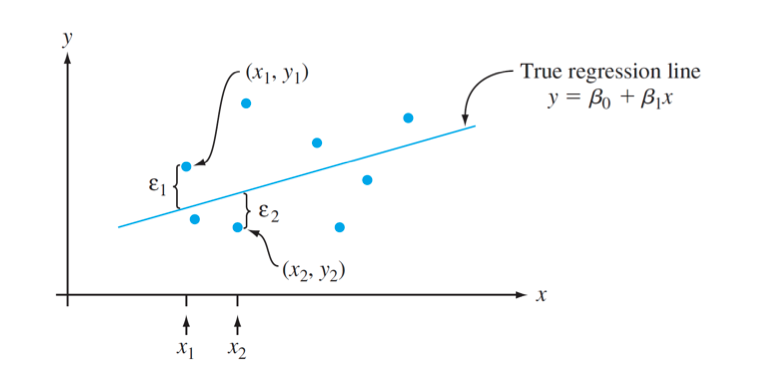

## Topics for Today

> **Motivating Question:** How do we model the relationship between two
> variables and make predictions using observed data?

::: {.fragment}
::: {.incremental}
-   Fitting a line to data: the least squares criterion
-   Least squares estimates $\hat\beta_0$ and $\hat\beta_1$
-   The simple linear regression model (normal error model)
-   MLE = Least Squares: why they agree
-   Estimating $\sigma^2$
-   Regression in R with `lm()` and `summary()`
:::
:::


------------------------------------------------------------------------

## Modeling the Effect of Advertising on Sales

> :bulb: A classic question in business and economics:

> **"Did the advertising campaign increase sales?"**

Firms invest heavily in advertising. They want evidence that their
spending leads to measurable gains.

------------------------------------------------------------------------

## So How Do You Answer That?

-   You have **data**: weekly ad spending, sales revenue, market
    conditions.
-   You suspect: more advertising → higher sales.
-   But: sales fluctuate due to many factors: seasons, pricing,
    competitors, random noise...

. . .

> :question: **How do we isolate the effect of advertising from
> everything else?**

. . .

-   Can we **quantify** the average change in sales per \$1000 spent?
-   Can we separate **signal from noise**?
-   Can we **predict** sales based on ad spending?


# Part I: Fitting a Line to Data

------------------------------------------------------------------------

## A Simple Question

> We have paired data $(x_1, y_1), \ldots, (x_n, y_n)$.
> We think the relationship is **roughly linear**.
> How do we find the **best fitting line**?

. . .

Any line can be written as $\hat y = b_0 + b_1 x$.

**But which $b_0$ and $b_1$ are "best"?**

---

## Example: Swirling Time vs Distance

From the  funnel lab: predict `tswirl` from `distance`.

**Variables:**  
- $x$ = distance up the channel (cm)  
- $y$ = swirling time (sec)  

```r
funneldata <- read.csv("http://people.kzoo.edu/enordmoe/math365/data/funneldata.csv")
plot(tswirl ~ distance, data = funneldata)
abline(lm(tswirl ~ distance, data = funneldata), col = "red")
lm(tswirl ~ distance, data = funneldata)
```

------------------------------------------------------------------------

### Funnel Data: Output {.smaller}

```{r}
#| echo: false
funneldata <- read.csv("http://people.kzoo.edu/enordmoe/math365/data/funneldata.csv")
plot(tswirl ~ distance, data = funneldata)
abline(lm(tswirl ~ distance, data = funneldata), col = "red")
lm(tswirl ~ distance, data = funneldata)
```

------------------------------------------------------------------------

## What Is a Residual?

For an observed data point $(x_i, y_i)$ and a proposed line $b_0 + b_1 x$:

$$
e_i = y_i - (b_0 + b_1 x_i)
$$

::: {.fragment}
The **residual** $e_i$ is the vertical distance from the point to the line.

- Positive residual: point is **above** the line
- Negative residual: point is **below** the line
:::

------------------------------------------------------------------------

## The Least Squares Criterion

> Choose $b_0$ and $b_1$ to **minimize the sum of squared residuals**:

$$
\text{SSE}(b_0, b_1) = \sum_{i=1}^n (y_i - b_0 - b_1 x_i)^2
$$

. . .

::: callout-note
**Why squared?**

- Treats positive and negative residuals symmetrically
- Penalizes large errors more heavily
- Leads to clean, closed-form estimates
:::

------------------------------------------------------------------------

## Least Squares Estimates

Setting partial derivatives equal to zero and solving yields:

::: callout-important
$$
\hat{\beta}_1 = \frac{S_{xy}}{S_{xx}} = \frac{\sum (x_i - \bar{x})(y_i - \bar{y})}{\sum (x_i - \bar{x})^2}
\qquad
\hat{\beta}_0 = \bar{y} - \hat{\beta}_1 \bar{x}
$$
:::

. . .

Key observations:

- $\hat\beta_1$ is the slope: change in predicted $y$ per unit increase in $x$
- $\hat\beta_0$ is the intercept: predicted $y$ when $x = 0$
- The Least Squares line always passes through $(\bar x, \bar y)$


# Part II: The Simple Linear Regression Model

------------------------------------------------------------------------

## From Fitting to Modeling

So far: least squares gives us **a** line — the one that fits the data best.

. . .

But to do **inference** (confidence intervals, hypothesis tests, prediction intervals), we need a **probability model** that describes how the data were generated.

------------------------------------------------------------------------

## The Simple Linear Regression Model

$$
Y_i = \beta_0 + \beta_1 x_i + \epsilon_i, \quad i = 1, \ldots, n
$$

::: callout-important
**Model assumptions:**

- $\epsilon_1, \ldots, \epsilon_n$ are **independent**
- $\epsilon_i \sim N(0, \sigma^2)$ (same variance for all $i$)
- $x_i$ are **fixed** (not random)
:::

. . .

Equivalently: $Y_i \sim N(\beta_0 + \beta_1 x_i,\; \sigma^2)$, independently.

------------------------------------------------------------------------

## What the Model Says

$$
E(Y \mid x) = \beta_0 + \beta_1 x
$$

The **mean** response is a linear function of $x$.

Individual responses scatter around this line with **constant spread** $\sigma$.

. . .

{fig-alt="scatterplot of true model" fig-align="center"}

------------------------------------------------------------------------

# Part III: MLE = Least Squares

------------------------------------------------------------------------

## The Likelihood Function

Given the model $Y_i \sim N(\beta_0 + \beta_1 x_i, \sigma^2)$ independently, the joint density of the data is:

$$
L(\beta_0, \beta_1, \sigma^2) = \prod_{i=1}^n \frac{1}{\sqrt{2\pi}\,\sigma}
\exp\!\left\{-\frac{(y_i - \beta_0 - \beta_1 x_i)^2}{2\sigma^2}\right\}
$$

------------------------------------------------------------------------

## Maximizing the Likelihood

Taking the log:

$$
\ell(\beta_0, \beta_1, \sigma^2) = -\frac{n}{2}\ln(2\pi\sigma^2) - \frac{1}{2\sigma^2}\sum_{i=1}^n (y_i - \beta_0 - \beta_1 x_i)^2
$$

. . .

::: callout-note
**Key insight:**

For fixed $\sigma^2$, maximizing $\ell$ over $\beta_0$ and $\beta_1$ is equivalent to **minimizing**

$$\sum_{i=1}^n (y_i - \beta_0 - \beta_1 x_i)^2$$
:::

. . .

**Conclusion:** Under the normal error model, the MLEs of $\beta_0$ and $\beta_1$ are **identical to the least squares estimates.**

------------------------------------------------------------------------

## Estimating $\sigma^2$

The MLE of $\sigma^2$ is $\displaystyle\frac{\text{SSE}}{n}$, but this is **biased**.

The unbiased estimator divides by $n - 2$:

$$
\hat{\sigma}^2 = S^2 = \frac{\text{SSE}}{n-2} = \frac{\sum(y_i - \hat{y}_i)^2}{n-2}
$$

::: {.fragment}
The quantity $S = \hat\sigma$ is reported as **Residual standard error** in R's `summary()` output.

- Degrees of freedom: we estimated **2** parameters ($\beta_0$, $\beta_1$), so $n - 2$ df remain.
:::

------------------------------------------------------------------------

## Interpreting `summary(lm())` {.smaller}

Key pieces of R output:

| Output field | What it estimates |
|---|---|
| `(Intercept)` estimate | $\hat\beta_0$ |
| Slope estimate | $\hat\beta_1$ |
| Residual standard error | $\hat\sigma = \sqrt{\text{SSE}/(n-2)}$ |
| Std. Error (coefficients) | SE of $\hat\beta_0$, $\hat\beta_1$ (next section) |


------------------------------------------------------------------------

## Summary

::: {.incremental}
- **Least squares** chooses $\hat\beta_0$, $\hat\beta_1$ to minimize $\sum e_i^2$   
  — no probability model needed
- The **normal linear model** adds: $\epsilon_i \overset{\text{iid}}{\sim} N(0,\sigma^2)$  
- Under this model, **MLE = least squares** for $\beta_0$ and $\beta_1$  
- Variability is estimated by $\hat\sigma^2 = \text{SSE}/(n-2)$  
- Use `lm()` and `summary()` in R to fit and inspect the model  
:::

