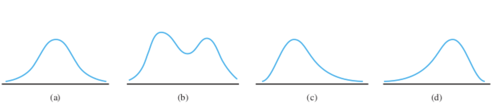

## Opening Question

> **You have 2,348 survey responses. Some answers are words. Some are
> numbers. What determines what you can do with each?**

::: notes
Give 30 seconds of quiet thinking. Take 2--3 responses. Goal: surface
the intuition that variable *type* constrains your choices. Don't define
anything yet --- just let students articulate what they already sense.
:::

## The GSS2018 Dataset {.smaller}

-   The **General Social Survey (GSS)**, begun in 1972, is a
    long-running longitudinal survey on the attitudes, behaviors, and
    demographics of US adults.

-   Conducted by NORC at the University of Chicago; tracks politics,
    religion, work, and social life.

-   **GSS2018** from the R package **resampledata3** contains a subset
    of the 2018 data.

```{r}
library(resampledata3)
names(GSS2018)
```

::: notes
Ask: "Scan these variable names. Which ones are categorical? Which are
quantitative? How can you tell?" Give pairs 60 seconds to sort a few
variable names before moving on.
:::

# Categorical Data {background-color="#FAD9C7"}

## What Do You Expect?

Look at the variable `GenderNow` in GSS2018.

**Before we look at the data** --- with your partner, write down:

1.  How many response categories do you expect?
2.  Roughly what proportion would you guess for each?

::: notes
Give 60--90 seconds. Write a few predictions on the board and return to
them after the table appears. Predictions make actual distributions
either surprising or confirming --- both are engaging.
:::

## Frequency Tables {.smaller}

```{r}
summary(GSS2018$GenderNow)   # Shows NAs
table(GSS2018$GenderNow)     # Frequency table
```

::: callout-note
## Watch for NAs

`table()` silently drops `NA` values; `summary()` shows them. This
matters when missing data may be informative.
:::

::: notes
Return to board predictions. Were students surprised? Ask: "Does the
proportion of NAs concern you? What might cause someone to skip this
question?" Both the counts and the missingness are worth discussing.
:::

## Relative Frequency Tables {.smaller}

```{r}
# Relative frequencies
prop.table(table(GSS2018$GenderNow))

# With row/column totals
addmargins(prop.table(table(GSS2018$GenderNow)))
```

::: notes
Ask: "Why might we prefer proportions over counts when comparing two
surveys of different sizes?" This primes them for why bar charts of
proportions are often more useful than frequency bar charts.
:::

## Gender Identity Bar Charts

::: panel-tabset
### Frequency

```{r}
barplot(table(GSS2018$GenderNow))
```

### Relative Frequency

```{r}
barplot(prop.table(table(GSS2018$GenderNow)), ylab = "Proportion")
```

### Percent

```{r}
barplot(100*prop.table(table(GSS2018$GenderNow)), ylab = "Percent")
```
:::

::: notes
Before clicking through tabs, ask: "What changes between these three
plots? What stays the same? Which would you use in a written report, and
why?" The last question depends on audience --- a useful discussion
about statistical communication.
:::

## Quick Customization Challenge

**You have 2 minutes.** Modify this code to add a title and a better
x-axis label:

```{r}
#| eval: false
barplot(prop.table(table(GSS2018$GenderNow)), ylab = "Proportion")
```

::: callout-note
## Hint

Check `?barplot` and look for the `main` and `xlab` arguments.
:::

::: notes
Circulate while students work. After 2 minutes, have one student share
their version on the projector or read their code aloud. Low-stakes live
coding practice; builds early confidence with R documentation.
:::

# Quantitative Data {background-color="#FAD9C7"}

## Still in GSS2018 {.smaller}

We don't need to switch datasets. GSS2018 has quantitative variables
too.

```{r}
head(GSS2018[, c("Age", "Employed", "Income")])
```

**With your partner:** Are these continuous or discrete? How can you
tell?

::: notes
Key nuance: HoursWorked is technically discrete (whole numbers) but
spans a wide range, so it's often treated as continuous. Age in years is
discrete. Income may be top-coded. These distinctions matter for
choosing a visualization. Let students argue it out before you weigh in.
:::

## Continuous vs. Discrete {.smaller}

::: incremental
-   **Continuous** variables take values on a continuous scale:
    -   Height, cholesterol, marathon time, rates and proportions
-   **Discrete** variables are quantitative but *not* continuous:
    -   Number of siblings, age in years, cigarettes per day
:::

::: callout-note
## In Practice

Some discrete variables span a wide range and are routinely treated as
continuous. Context and judgment matter more than rigid rules.
:::

## The Checklist: What to Look for in Any Distribution

Every time we look at a quantitative distribution, we ask:

::: incremental
-   **Shape**: symmetric, skewed left/right, bimodal, multimodal?
-   **Center**: where does the bulk of the data sit?
-   **Spread**: how much variability is there?
-   **Outliers**: any unusual observations?
:::

::: notes
This is the checklist students will apply to every plot today and
throughout the course. Post it visibly --- students can write it on
their one-pager. Don't define each term formally yet; let the plots
give them content for the definitions.
:::

## Dotplots {.smaller}

::: panel-tabset
### Hours Worked

```{r}
stripchart(GSS2018$HoursWorked, method = "stack",
           xlab = "Hours Worked per Week")
```

### Age

```{r}
stripchart(GSS2018$Age, method = "stack",
           xlab = "Age (years)")
```
:::

**Apply the checklist.** What do you see about shape, center, spread,
and outliers?

::: notes
Ask students to narrate each plot using the four-part checklist before
you say anything. For HoursWorked: expect a spike at 40, right skew.
For Age: fairly uniform or slight skew. Don't supply the description ---
call on students and push them to use the checklist language.
:::

## Dotplot Limitations

::: incremental
-   Good quick look for small datasets or discrete data
-   Continuous data → overlapping points, visual clutter
-   Works better as a first glance than a final display
:::

::: notes
Ask: "Why does stacking work well for HoursWorked but less well for
Age?" The answer leads naturally to histograms as the solution for
continuous data with many distinct values.
:::

## Histograms {.smaller}

::: panel-tabset
### Hours Worked

```{r}
hist(GSS2018$HoursWorked, xlab = "Hours Worked per Week")
```

### Age

```{r}
hist(GSS2018$Age, xlab = "Age (years)")
```

### Income

```{r}
hist(GSS2018$Income, xlab = "Income")
```
:::

**Same checklist. What changed from the dotplot?**

::: notes
Key discussion: what did binning hide (the spike at 40 hours may smooth
out)? What did binning reveal (overall shape)? This is the fundamental
tradeoff in histogram design. The Income histogram will likely show
strong right skew --- ask whether that surprises anyone.
:::

## Why Density? The Core Idea

When class widths are **unequal**, plotting frequency misleads.
Instead:

$$
\text{Rectangle Height} = \frac{\text{Relative frequency}}{\text{Class width}}
$$

This ensures: **area = relative frequency** for every rectangle.

**Worked example:** Suppose 6 of 32 cars fall in the 20--22 mpg bin
(width = 2).

$$
\text{Height} = \frac{6/32}{2} = \frac{0.1875}{2} = 0.094
$$

So the rectangle covers exactly 18.75% of the data. :white_check_mark:

::: notes
Walk through this on the board before showing R output. Then ask: "What
would happen to the height if we doubled the bin width but kept the same
6 cars?" Height halves, area stays the same --- that is the key insight.
Make sure students see why this matters before seeing the plots.
:::

## Equal vs. Unequal Bins {.smaller}

::: panel-tabset
### Equal Width (default)

```{r}
#| fig-height: 3
hist(GSS2018$HoursWorked, xlab = "Hours Worked per Week")
```

### Unequal Width (density)

```{r}
#| fig-height: 3
hist(GSS2018$HoursWorked,
     breaks = c(0, 20, 35, 40, 45, 60, 89),
     xlab = "Hours Worked per Week")
```

### Unequal Width (WRONG)

```{r}
#| fig-height: 3
hist(GSS2018$HoursWorked,
     breaks = c(0, 20, 35, 40, 45, 60, 89),
     freq = TRUE,
     xlab = "Hours Worked per Week")
```
:::

::: notes
The WRONG tab is essential --- students need to see what misleading
actually looks like. Ask: "Which bar looks inflated in the WRONG
version? Why?" The wide early bins will appear too prominent when
frequency rather than density is plotted.
:::

## Classify These Shapes

**Before I label them** --- classify each histogram:

*symmetric / skewed left / skewed right / bimodal / uniform*



::: notes
Cover labels if possible using the chalkboard overlay. Call on students
to classify and justify each one. The goal is active interpretation, not
passive recognition of labeled examples.
:::

## A Surprising One

```{r}
hist(faithful$waiting, xlab = "Waiting Time (min)",
     main = "Old Faithful: Time Between Eruptions")
```

**What shape is this? What might explain it?**

::: notes
Bimodal! Ask students to speculate about the mechanism before
explaining. Answer: two types of eruptions (short and long cycles)
produce two clusters of waiting times. The result is more memorable
if students have wrestled with it. This also previews mixture
distributions they will encounter later in the course.
:::

## Summary

::: incremental
-   **Variable type** determines your visualization options
-   **Categorical** → frequency tables and bar charts
-   **Quantitative** → dotplots (small/discrete) and histograms
    (larger/continuous)
-   Always describe **shape, center, spread, outliers**
-   With unequal bin widths, use **density** (not frequency) as height
:::

::: notes
Exit question: "What's the one thing from today you'd want a classmate
who missed class to know?" Quick informal close that doubles as a
comprehension check.
:::

# Practice {background-color="#FAD9C7"}

## Practice 1: Graduation Rates {.smaller}

```{r}
#| eval: false
gradrates <- read.csv("http://people.kzoo.edu/enordmoe/math365/data/exp01-08.csv")
```

Using your one-pager as a guide:

1.  `View()` the data. Which variable represents college degree percent?
2.  Use `stripchart()` to make a dotplot. How does it compare to Figure
    1.6 in the text?
3.  Make three histograms of college degree percent:\
    i. Equal width, frequency as height\
    ii. Equal width, density as height\
    iii. Unequal width, density as height
4.  Apply the shape/center/spread/outlier checklist to each.

::: notes
Pairs. Circulate and listen for confusion around density scaling --- that
is the most common sticking point. Have one pair share their dotplot
comparison after 5 minutes.
:::

## Practice 2: Old Faithful {.smaller}

**With your partner:**

1.  Type `?faithful` at the console to learn about the dataset.
2.  Explore both `eruptions` and `waiting` with at least two plot types
    each.
3.  Classify the shape of each distribution and write **one sentence**
    describing what it tells you about the geyser.
4.  Try a density plot: `plot(density(faithful$waiting))`
5.  **Share:** Which graph was most useful, and why?

::: callout-note
## Going Further

Try adjusting the `adjust` parameter in `density()`. What happens to the
smoothness? What are the tradeoffs?
:::

::: notes
The deliverable (one sentence per variable) keeps this focused. After
7 minutes, have two pairs share their sentence. Do they describe the
same features? This surfaces what "useful" means in practice and is a
good lead-in to the idea that visualization choices are not neutral.
:::
