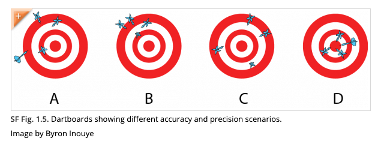

## Topics for Today

-   Point estimators and their properties
-   Mean Squared Error (MSE) :bulb:
-   Unbiasedness
-   MVUEs
-   Standard errors

------------------------------------------------------------------------

## Point Estimators :round_pushpin:

::: callout-important
**Definition.** A **point estimate** of a parameter $\theta$ is a single
number considered a sensible value for $\theta$, based on a sample.

The **point estimator** is the rule or function used to generate this
value. Since it's computed from a random sample, it is itself a **random
variable**.
:::

:question: *What’s the difference between a statistic and an estimator?*

------------------------------------------------------------------------

## Hitting the Mark?

::: incremental
-   Which estimator would you use?

-   Which do you prefer between B and C?
:::

::: aside
Source:[https://manoa.hawaii.edu/exploringourfluidearth/](https://manoa.hawaii.edu/exploringourfluidearth/physical/world-ocean/map-distortion/practices-science-precision-vs-accuracy#:~:text=Accuracy%20refers%20to%20how%20close,Precision%20is%20independent%20of%20accuracy).
:::

## Bias and Unbiased Estimators :dart:

::: callout-important
**Definition.**\
An estimator $\hat{\theta}$ is **unbiased** for $\theta$ if:\
$$
E(\hat{\theta}) = \theta
$$

If not, the bias is: $\text{Bias}(\hat{\theta}) =E(\hat{\theta}-\theta)$
:::

## :trophy: Hall of Fame of Unbiased Estimators

-   The sample mean $\bar{X}$ is an unbiased estimator of $\mu$ from a
    normal distribution.

-   The sample proportion $\hat{p} = X/n$ is an unbiased estimator of a binomial probability
    $p$.

-   The sample variance $S^2$ is an unbiased estimator of $\sigma^2$.

##   {style="font-size: 50%"}
### Mean Squared Error (MSE)

::: callout-note
**Definition.** The **Mean Squared Error** of an estimator $\hat{\theta}$ is:
$$
\text{MSE}(\hat{\theta}) = E[(\hat{\theta} - \theta)^2]
$$
:::

::: fragment
Add and subtract $E(\hat{\theta})$ inside the square:
$$
(\hat{\theta} - \theta)^2 = \bigl[(\hat{\theta} - E(\hat{\theta})) + (E(\hat{\theta}) - \theta)\bigr]^2
$$
:::

::: fragment
Expand:
$$
= (\hat{\theta} - E(\hat{\theta}))^2 + 2(\hat{\theta} - E(\hat{\theta}))(E(\hat{\theta}) - \theta) + (E(\hat{\theta}) - \theta)^2
$$
:::

::: fragment
Take expectations. The cross term vanishes since $E[\hat{\theta} - E(\hat{\theta})] = 0$:
$$
\text{MSE}(\hat{\theta}) = E\bigl[(\hat{\theta} - E(\hat{\theta}))^2\bigr] + (E(\hat{\theta}) - \theta)^2
$$
:::

::: fragment
Recognize the pieces:
$$
\text{MSE}(\hat{\theta}) = \text{Var}(\hat{\theta}) + [\text{Bias}(\hat{\theta})]^2
$$
:::

::: fragment
So a **biased** estimator can have *lower* MSE than an **unbiased** one — if its variance is small enough.
:::

##  {.smaller}
### Sample Variance: A Setup for Unbiasedness :abacus:

We define the **sample variance** as: 
$$
S^2 = \frac{1}{n - 1} \sum_{i=1}^n (X_i - \bar{X})^2
$$

-   This uses $\bar{X}$ in place of the unknown mean $\mu$.
-   The denominator is $n - 1$ instead of $n$ (Why? we'll find out)

::: fragment
We’ll show that: 
$$
E(S^2) = \sigma^2
$$ So $S^2$ is an **unbiased estimator** of population variance!

:brain: Hint: this involves expanding $(X_i - \bar{X})^2$ and working
with expectations.
:::

------------------------------------------------------------------------

## Estimators with Minimum Variance :brain:

::: callout-tip
**Definition.**\
An unbiased estimator with the **lowest variance** among all unbiased
estimators is called the **Minimum Variance Unbiased Estimator (MVUE)**.
:::

## Theorem (MVUE for the Mean)

Let $X_1, \dots, X_n \stackrel{\text{iid}}{\sim} N(\mu, \sigma^2)$.\  

Then $\hat{\theta} = \bar{X}$ is the **MVUE** of $\mu$.

::: fragment
:eight_spoked_asterisk: *Minimum variance estimators do more with less!*
:::

## Standard Error :straight_ruler: {.smaller}

::: callout-note
**Definition.** The **standard error** of an estimator $\hat{\theta}$
is:\
$$
\sigma_{\hat{\theta}} = \sqrt{\text{Var}(\hat{\theta})}
$$
:::

::: fragment
Often, we replace unknown quantities with estimates → **estimated
standard error**:

$$\hat{\sigma}_{\hat{\theta}}$$

:hammer_and_wrench: Used to construct confidence intervals and assess
estimator precision.
:::

---

## Summary :star2:

-   A **point estimator** is a random variable computed from sample
    data.
-   MSE = variance + bias$^2$
-   **Unbiased** estimators have $E(\hat{\theta}) = \theta$
-   **MVUE**: most efficient among unbiased estimators
-   **Standard error** quantifies estimator variability

